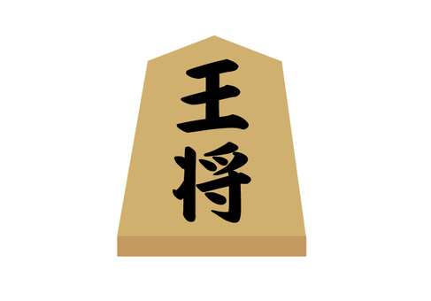

# shogiBot
Discord bot for playing shogi (japanese chess) made with Discord.js and PIL  
Requires node.js with packages `child_process` and `discord.js`  
  
Poorly cobbled together by me only a week after I learned how to play.  
Curretly *no where close* to being done. Check back for updates.
## Basic Commands
`s.help`  
`s.rules`  
`s.play`  
`s.accept`  
`s.style`  
`s.move`  
`s.drop`  
`s.undo`  
`s.resign`
## Image sources
Board and Pieces: https://genedavissoftware.com/  
Numbers: https://www.onlygfx.com/  
Pictures used in piece explanations: From Wikimedia Commons, the free media repository  
- By en:user:Akanemoto / Public domain  
- By Hari Seldon / CC BY-SA (https://creativecommons.org/licenses/by-sa/3.0)
